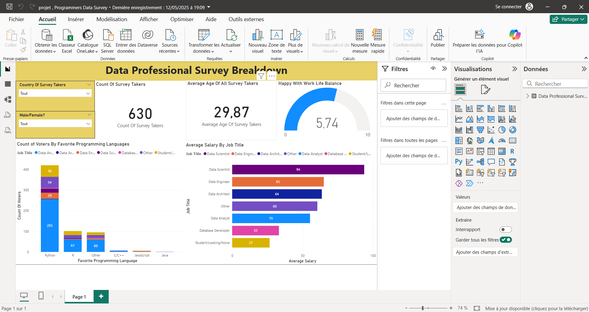

# Power BI Dashboard — Data Professionals Survey Analysis

[Français](#français) · [English](#english)

## Français

### Présentation
Projet Power BI consacré à l'analyse d'une enquête auprès de professionnels de la Data.

Le tableau de bord permet d'explorer le profil des répondants, les salaires moyens selon les métiers, les langages de programmation préférés et la satisfaction liée à l'équilibre entre vie professionnelle et vie personnelle.

### Indicateurs et analyses
- Nombre de répondants : **630**
- Âge moyen des répondants : **29,87 ans**
- Analyse du salaire moyen selon le métier
- Analyse des langages de programmation préférés
- Satisfaction concernant l'équilibre vie professionnelle / vie personnelle
- Filtres par pays et par sexe

### Outils et compétences
**Power BI** · **Data Analysis** · **Data Visualization**

### Fichier du projet
[**Télécharger le fichier Power BI (.pbix)**](./projet%20%2C%20Programmers%20Data%20Survey.pbix)

### Statut
**Terminé**

---

## English

### Overview
Power BI project analyzing survey data from Data professionals.

The dashboard explores respondent profiles, average salaries by job role, preferred programming languages and satisfaction with work-life balance.

### Indicators and analysis
- Survey respondents: **630**
- Average respondent age: **29.87 years**
- Average salary analysis by job role
- Preferred programming language analysis
- Work-life balance satisfaction
- Filters by country and gender

### Tools and skills
**Power BI** · **Data Analysis** · **Data Visualization**

### Project file
[**Download the Power BI file (.pbix)**](./projet%20%2C%20Programmers%20Data%20Survey.pbix)

### Status
**Completed**
